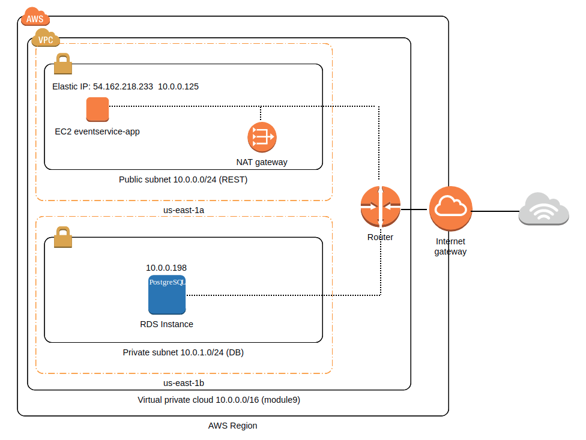

### Task 
At the end of this homework you need to have: 
- AWS Admin (your user that can manage everything in account); 
- EC2 Admin user that can connect to your EC2 users via SSH and can`t work with RDS;
- RDS Admin user that can manage RDS, but can`t manage EC2;
- VPC with 2 subnets and security groups (will provide security group configuration as basic EPAM configuration);
- 2 EC2 instances: - EC2 instance with your application from Spring homework; - EC2 instance with RDS;
- RDS should have configured update and backup policy; 

E-mail notification should be sent to RDS admin and AWS admin on configuration changes.


1 point :

Create AWS account. Create IAM users:   

EC2 Admin. RDS Admin.  

1 point :

Create VPC with 2 subnets and set up separate security groups for these subnets and restrict connection types from internet to this VPC:  

REST, DB  

1 point :

Create servers from AMI for:  

Web Application(EC2). Install OpenJDK 1.8  
DB(RDS). PostgreSQL DB.

1 point :   

Setup RDS  

Configure update and backup policy.  

Send email notification to Administrator and DB Admin on Event(exchange configuration)  

1 point :  

Deploy application from your Spring to EC2 server and migrate DB to RDS.  
Note: you should create EC2 instance and run your application on it 

**RESULTS:**

Implemented the following VPC:



With the following settings:

- [EC2 Admin (ec2admin)](attachments/ec2admin.png)
- [RDS Admin (rdsadmin)](attachments/rdsadmin.png)
- [Public subnet](attachments/publicsubnet.png)
- [Private subnet](attachments/privatesubnet.png)
- [Security group for EC2 instance](attachments/ec2sg.png)
- [Security group for RDS instance](attachments/rdssg.png)
- [EC2 instance](attachments/ec2instance.png)
- [RDS Postgres DB](attachments/rdsinstance.png)
- [RDS backup policy](attachments/db_backup.png)
- [Cloud Watch Event for RDS instance change](attachments/cw_event.png) and [SNS topic](attachments/notification.png)


Running event-service-rest app on EC2 instance:

Please see event-service app [sourcecode](../module2), which is updated to work with Postgres DB.

Build project: 
  
  ```markdown
cd module2/
mvn install
  ```

Copy executable jar to EC2 instance: 
  
  ```markdown
cd event-service-rest/target
scp -i ~/Downloads/awsdemo.pem event-service-rest-1.0-SNAPSHOT.jar ec2-user@54.162.218.233:~/
  ```
  
Run jar on EC2 instance with DB credentials:

  ```markdown
java -jar -Dserver.port=8084 -Dspring.datasource.url=jdbc:postgresql://10.0.0.198:5432/postgres -Dspring.datasource.username=postgres -Dspring.datasource.password=postgres event-service-rest-1.0-SNAPSHOT.jar
  ```
  
Testing app:
- [Running app](attachments/running_app.png)
- [Post request](attachments/post_event.png)
- [Get request](attachments/get_events.png)

